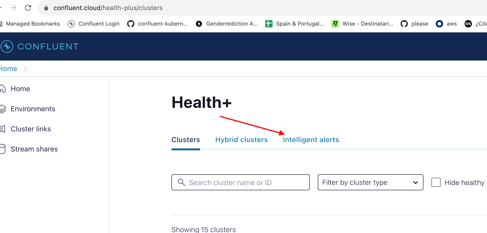
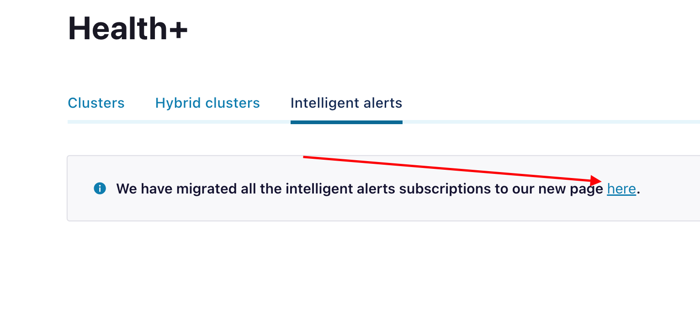
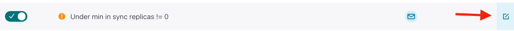
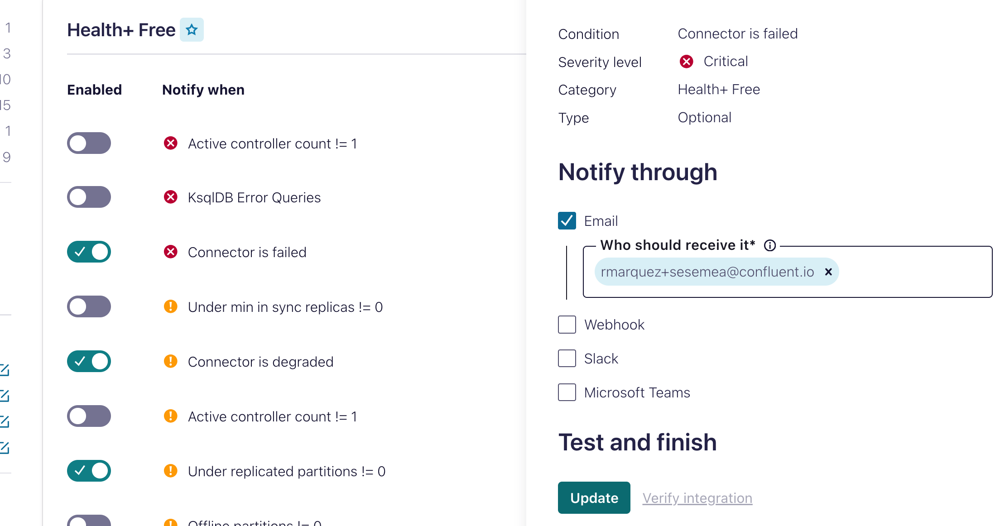

# Workshop Health+

## First Steps
To be able to use health + you'll need to create a confluent cloud account, please create one in: 
- https://www.confluent.io/get-started/

Once you have a confluent cloud account please create a cloud api to send metrics to Confluent Cloud


Clic **add key** , give **global access** and save api key and secret 

inside a terminal (powershell in windows), execute :
```bash
ssh ec2-user@<your_assigned_public_ip>
```
The password is shared by your instructor.

Then:
```bash
cd /home/ec2-user/healthplus_workshop/docker
```
modify the file .my-env with your credentials
```bash
vi .my-env
```
set the environment variables 
```bash
source .my-env
```
Then run docker compose:
```bash
docker-compose  up -d
```
## Walkthrough Control Center

Go to **http://<your_public_ip>>:9021/clusters** , check the info displayed in the home screen.
Do the same with the info inside **Cluster Overview**
You are seeing all the metrics, true?

Now lets stop control center:
```bash
docker stop workshop-control-center
```
and edit docker-compose.yml:
```bash
vi docker-compose.yml
```
change the line from:
```bash
CONTROL_CENTER_MODE_ENABLE: "all"
```
to

```bash
CONTROL_CENTER_MODE_ENABLE: "management"
```
start docker again:
```bash
docker-compose up -d
```
wait 1 minute and try to open again **http://<your_public_ip>:9021/clusters**

do you see something different?

## Walkthrough Cloud UI
Go to your cloud enviroment and check health + , to do so:


and then go to:


change the name of the monitoing cluster (put **production**):


Explore the metrics inside Health+

## Creating Alerts

To create alerts first of all we need to configure them. Go to the home page of health+ and select **Intelligent alerts**





First of all, check all the notification center.
Under the section **Health+ Free** activate **Connector is failed** and set the email 





Lets create an error setting to trigger this alert.

```bash
curl -s -X PUT -H  "Content-Type:application/json" http://localhost:8083/connectors/source-error/config -d '{"connector.class": "io.confluent.kafka.connect.datagen.DatagenConnector","key.converter": "org.apache.kafka.connect.storage.StringConverter","kafka.topic": "error_topic","max.interval": 1000,"schema.filename": "/datagen/error.avro","schema.keyfield": "error" }
```